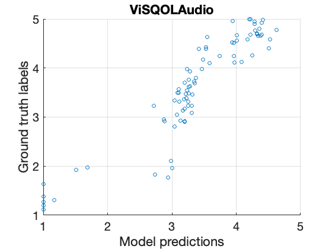
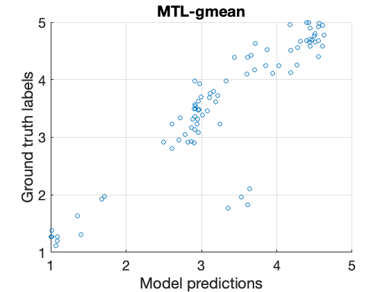

# A multitask teacher-student framework for perceptual audio quality assessment

## Introduction
This is the complementary repository for the following [publication](https://eurasip.org/Proceedings/Eusipco/Eusipco2021/pdfs/0000396.pdf):

```
Chih-Wei Wu, Phillip A. Williams, William Wolcott, 
"A multitask teacher-student framework for perceptual audio quality assessment",
in Proceedings of European Signal Processing Conference (EUSIPCO), 2021
```

Specifically, this repository includes:

1. Additional metrics (Please see the sections below)

2. Additional plots/figures (Please see the sections below)

3. Software implementation and pretrained model for the proposed system (Please see [here](./code/README.md) for more details.)

## Additional Metrics
Root mean square error (RMSE) was computed as a secondrary metric but not shown in the manuscript due to the space constraints. 

|        Systems  |      |          |   Test Datasets    |          |   |   Averaged RMSE     |      
|:---------------:|:-------------:|:--------:|:----------:|:-------:|:-----:  |:-------------:|
|                 | BS1387Conform | CoreSv14 | UnbAvq2013 |  NLow   | NHigh   |               |
|      HAAQI      |     0.913     |   0.886  |    0.717   | 1.601   | 0.278   |     0.879     |
|       PEAQ      |   **0.484**   | **0.440**|    1.183   | 1.669   | 0.484   |     0.852     |
|      PEMO-Q     |     0.608     |   0.638  |    1.147   | 1.292   | 0.242   |     0.786     |
|   ViSQOLAudio   |     0.697     |   0.982  |    0.597   |**0.492**| 0.497   |     0.653     |
|    STL-HAAQI    |     0.927     |   0.858  |    0.645   | 1.440   | 0.298   |     0.834     |
|     STL-PEAQ    |     1.125     |   0.791  |    1.041   | 0.966   | 0.546   |     0.894     |
|    STL-PEMO-Q   |     0.600     |   0.577  |    1.208   | 0.926   | 0.254   |     0.713     |
| STL-ViSQOLAudio |     0.714     |   0.992  |    0.618   | 0.528   | 0.596   |     0.690     |
|      MTL-T1     |     0.818     |   1.009  |    0.689   | 1.408   | 0.350   |     0.855     |
|      MTL-T2     |     0.960     |   0.871  |    1.082   | 1.024   | 0.687   |     0.925     |
|      MTL-T3     |     0.503     |   0.575  |    1.311   | 0.920   |**0.200**|     0.702     |
|      MTL-T4     |     0.604     |   0.943  |  **0.565** | 0.496   | 0.463   |   **0.614**   |
|     MTL-mean    |     0.582     |   0.746  |    0.758   | 0.805   | 0.281   |     0.634     |
|    MTL-gmean    |     0.524     |   0.713  |    0.904   | 0.645   | 0.295   |   **0.616**   |
|    MTL-median   |     0.577     |   0.758  |    0.721   | 0.785   | 0.284   |     0.625     |

## Additional Plots/Figures
The following scatter plots show the model predictions v.s. human ground truth on the combined proprietary (i.e., NLow + NHigh) datasets. Here we compare the best performing teacher system (ViSQOLAudio) and the best performing student system (MTL-gmean):



Fig. 1. ViSQOLAudio on {NLow + NHigh}



Fig. 2. MTL-gmean on {NLow + NHigh}

## Citing
To cite this work, please use the following:

```
@inproceedings{
  wu_2021,
  title={A multitask teacher-student framework for perceptual audio quality assessment},
  author={Wu, Chih-Wei and Williams, Phillip A and Wolcott, William},
  booktitle={European Signal Processing Conference (EUSIPCO)},
  year={2021}
}
```

## Contact
Chih-Wei Wu \
cwu307[at]gmail.com

